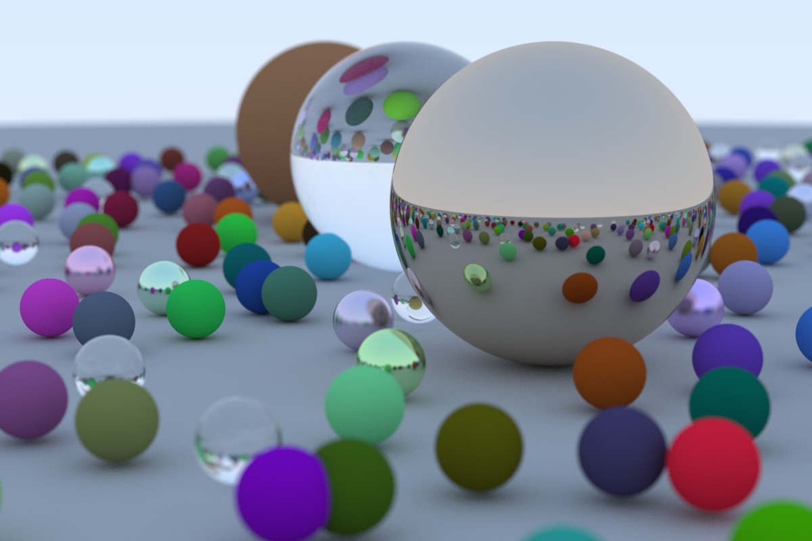
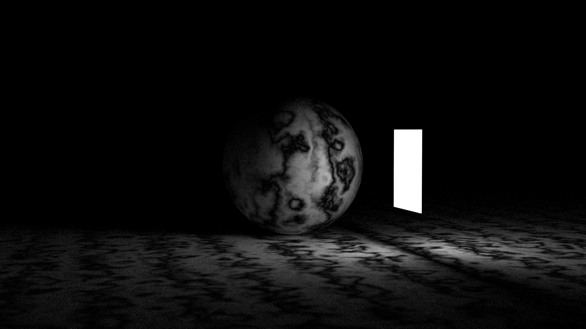
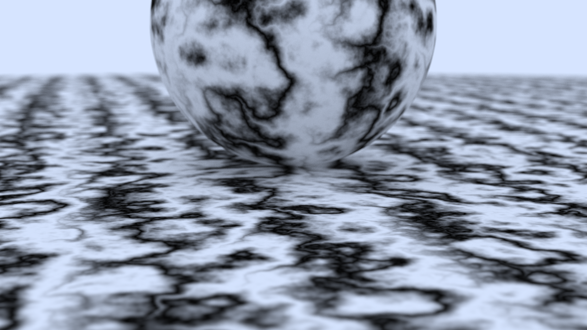
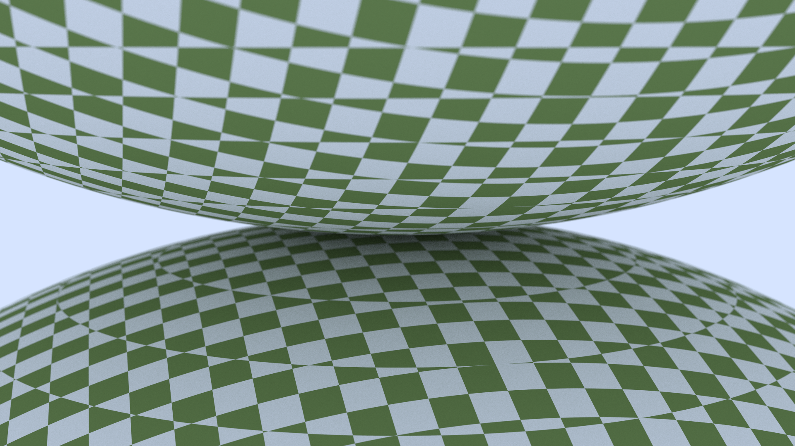

# Rust Raytracer

A Rust implementation of [_Ray Tracing in One Weekend_](https://raytracing.github.io/books/RayTracingInOneWeekend.html) and [_Ray Tracing: The Next Week_](https://raytracing.github.io/books/RayTracingTheNextWeek.html) by Peter Shirley.

Parallelised with [Rayon](https://github.com/rayon-rs/rayon) for multi-core rendering.

## Screenshots

| | |
|---|---|
|  |  |
|  |  |
|  |  |

## Scenes

| # | Scene |
|---|-------|
| 1 | Bouncing Spheres |
| 2 | Checkered Spheres |
| 3 | Earth |
| 4 | Perlin Spheres |
| 5 | Quads |
| 6 | Simple Light |
| 7 | Cornell Box |
| 8 | Cornell Smoke |
| 9 | Final Scene |

## Build

```sh
cargo build --release
```

## Usage

Output is written as PPM to stdout.

```sh
./target/release/ray-tracer <scene> <quality> > output.ppm
```

Quality: `low`, `med`, `high`, `final`
